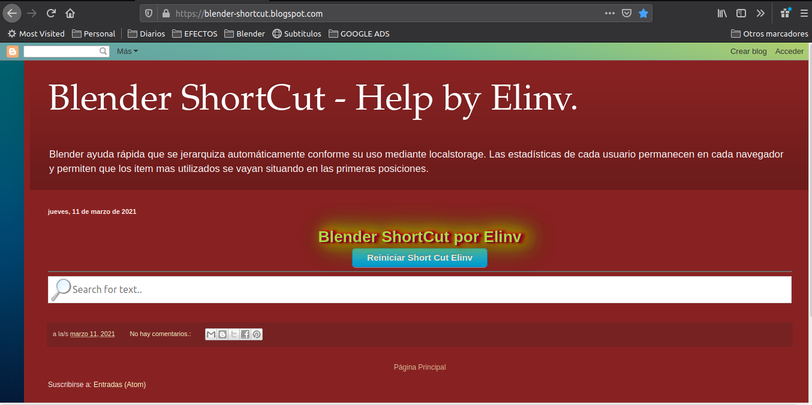
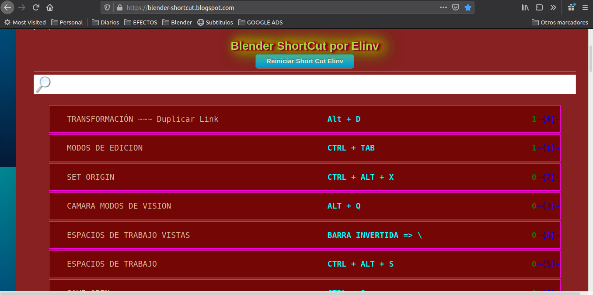
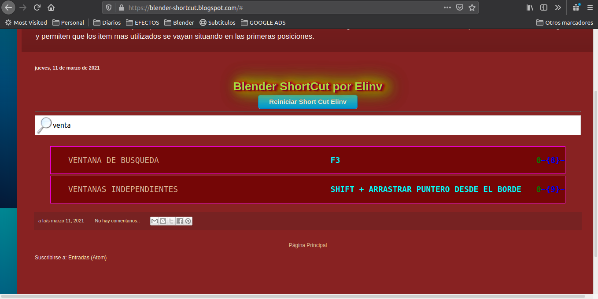
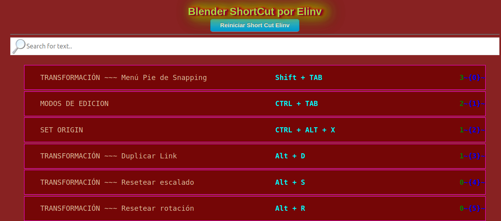
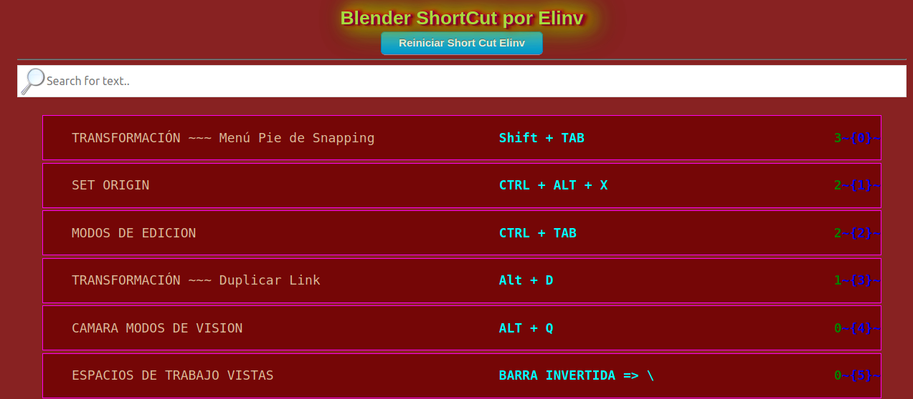
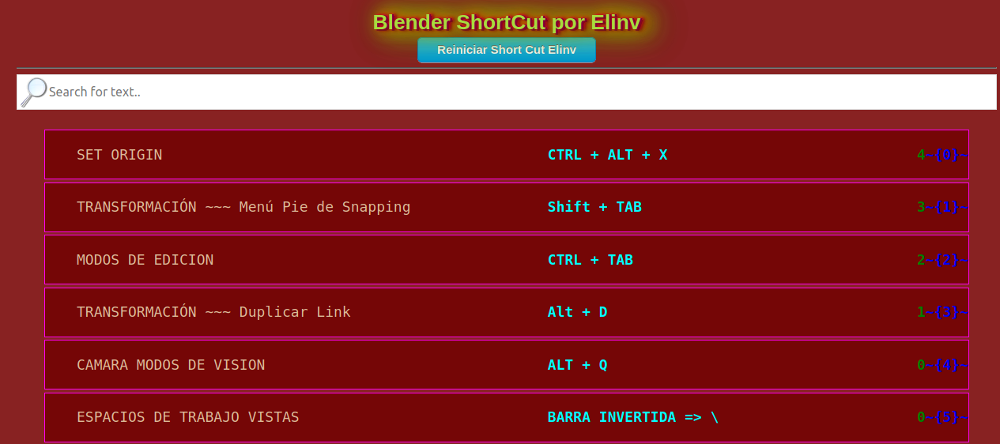

# javascript_lista_jerarquizada_dinamicamente
 
 - Ver Blender ShortCut - Help by Elinv en acción en:

<a href="https://blender-shortcut.blogspot.com/">
   En Javascript lista jerarquizada dinámica con localstorage
</a>

## 	elinv help

## Inicialmente se observa así:

**Al correr el cursor en el cuadro de busqueda se mostrará todo si es un espacio en blanco o se presiona la tecla retroceso o se busca algún contenido mediante su tipeo:**

*A medida que se hace click intencionalmente en los item hallados, los mismos se van posicionando en primer lugar y de acuerdo a la cantidad de click*

**Como funciona el cuadro de busqueda:**

**En las siguientes imagenes se observa como funciona la jerarquización de items -Observen SET ORIGIN-**

👍 Gracias!

🛠️ Errores, sugerencias, ideas, envialas a nuestro mail: <elinv.elinv@gmail.com>

# E L I N V @ 2021

